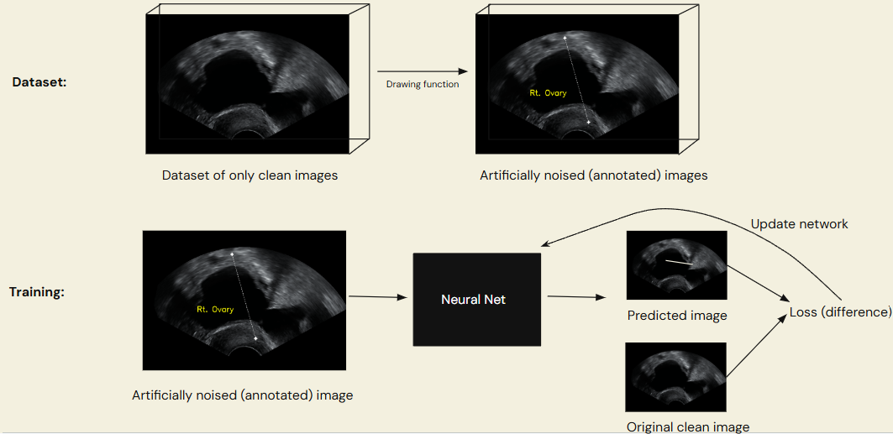

<em>This repository is part of my thesis on detecting ovarian cancer using deep learning approaches, and I will soon make all repositories related to this project public.</em>

# Denoising autoencoder to remove annotations embedded in medical images

Medical scans sometimes come with annotations drawn by the radiologist or doctor. These annotations can act as confounders for a deep learning method that aims to classify or segment these images.

For example, if radiologists draw arrows that point to benign tumors, a standard CNN will learn to recognize the arrows as indicators of a benign tumor. The arrows act as confounders, and the classifier will predict "benign" when it sees the arrows, even if the tumor is malignant.

## Example

Below are two examples of images with annotations removed using a trained denoising autoencoder:

Image from MMOTU with example of removing annotation

## How it works

### Training process

Given a dataset that has clean images (medical scans without annotations) and noisy images (medical scans with annotations), 

### Some examples

<table>
    <tr>
        <th>Original image</th>
        <th>Inferred (removed annotations)</th>
    </tr>
    <tr>
        <td></td>
        <td></td>
    </tr>
</table>

## Installation

Make a Conda environment (this has been developed and tested with Python 3.12.7) and run <em>pip install -r requirements.txt</em>

## Usage

Dataset structure: folder with "clean" and "annotated" subdirectories.
The image names in both directories should be the same (corresponding image pairs).

Training: python -m src.train

Inference:

## Config parameters

### Training parameters:

<ul>
    <li><em>loss_alpha:</em></li> Weighted loss term for annotated (foreground) parts of the image
    <li><em>loss_beta:</em></li> Weighted loss term for background parts of the image
    <li><em>resize_size:</em></li> Dimensions to resize the image
    <li><em>epochs:</em></li> Number of epochs
    <li><em>lr:</em></li>
    <li><em>batch_size:</em></li>
    <li><em>val_split:</em></li>
    <li><em>Architecture:</em></li> Either Autoencoder, or AutoencoderWithSkipConnections
</ul>